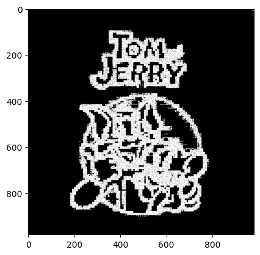
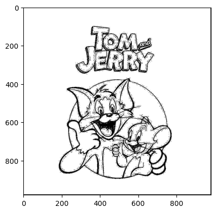

# Edge Detection

I tried various edge detection methods on multiple images downloaded from the internet. The filters like Sobel, Prewitt and Scharr gave decent results on simple images with no artefacts and lighting issues, but in images from real world or lots of details, they gave jarry or useless results.

## Sobel, Prewitt and Scharr

Simple filters gave results like

## Laplacian of Gaussian Filter

By Far, the best result across all pictures was given by the LoG filter.

## Canny Edge Detection

Even after lots of parameter tuning and changing pictures, canny edge could not give satisfactory result. An example of this was

